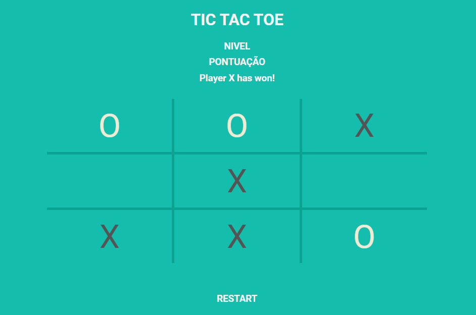

<h2 align="center">
Tic Tac Toe (Jogo da Velha)
</h2>

 

  

<h3 align="center">  
  <a href="#information_source-sobre">Sobre</a> |
  <a href="#interrobang-motivo">Motivo</a> | 
  <a href="#rocket-tecnologias-utilizadas">Tecnologias</a> | 
  <a href="#link-como-contribuir">Como Contribuir</a> | 
  <a href="#licença">Licença</a> 
</h3>

## :information_source: Sobre

Se trata de um jogo da velha.

## :interrobang: Motivo

Foi realizado com o intuito de fixar o conhecimento sobre Grid CSS construindo uma aplicação real e simples, foi desenvolvido em inglês como forma de estudo também.

## :rocket: Tecnologias Utilizadas

O projeto foi desenvolvido utilizando as seguintes tecnologias

- Grid CSS
- HTML
- JavaScript

## :bookmark_tabs: TODO List

- :ballot_box_with_check: Criar Estrutura
- :ballot_box_with_check: Criar Estilo
- :ballot_box_with_check: Criar Script com as regras
- Inserir Pontuação
- Melhorar Layout
- Inserir Single Player
- Inserir Nivel no Single Player

## :link: Como contribuir

- Faça um Fork do repositório,
- Faça um clone do respositório
- Crie uma branch com a sua feature
- Faça um commit com suas mudanças
- Push a sua branch
- Ir em Pull Requests do projeto original e criar uma pull request com o seu commit

## Licença
Esse projeto está sob a licença GLP. Veja o arquivo [LICENSE](LICENSE) para mais detalhes.